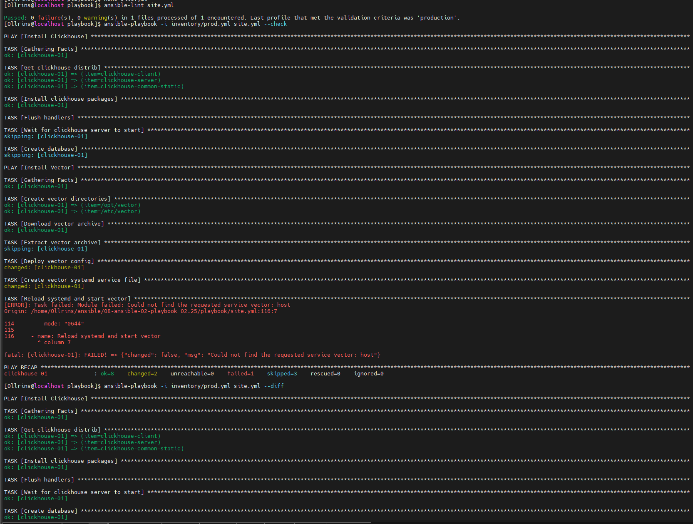
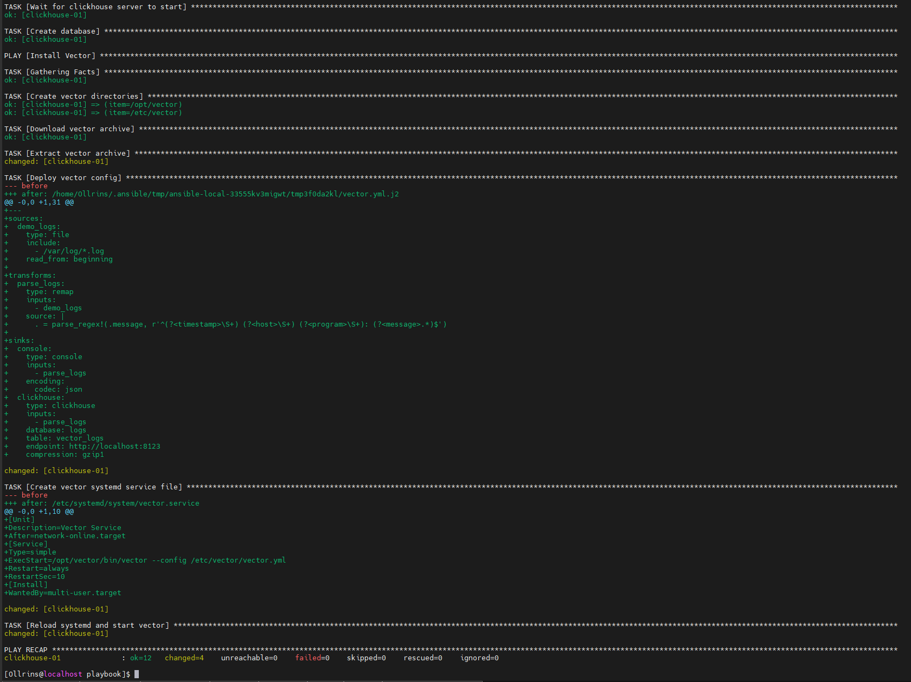
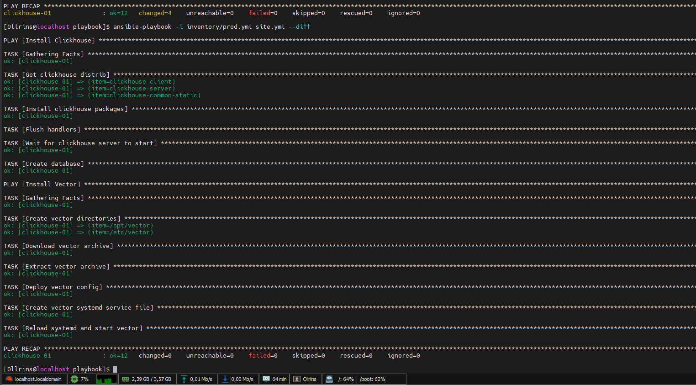

### Домашнее задание к занятию 2 «Работа с Playbook»

#### Задание 5

 

  
   
  <em>ansible-lint site.yml и playbook с флагом --chec</em>

#### Задание 6

  
   
  <em>playbook на prod.yml окружении с флагом --diff</em>

#### Задание 7

  
   
  <em>playbook с флагом --diff, playbook идемпотентен</em>

