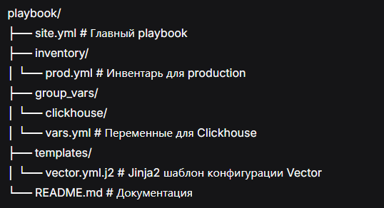

### Домашнее задание к занятию 2 «Работа с Playbook»

#### Задание 5

<br>
<p align="center">
  
  <br>
  <em>ansible-lint site.yml и playbook с флагом --check</em>
</p>

#### Задание 6

<p align="center">
  
  <br>
  <em>playbook на prod.yml окружении с флагом --diff</em>
</p>

#### Задание 7

<p align="center">
  
  <br>
  <em>playbook с флагом --diff, playbook идемпотентен</em>
</p>

<br>
[Исходный код](https://github.com/Ollrins/Ansible-Playbook/tree/main/playbook "Ссылка на GitHub")


### Ansible Playbook для установки Clickhouse и Vector

#### Описание

Данный playbook автоматизирует установку и настройку:
- **Clickhouse** (версия 22.3.3.44) - СУБД для аналитики логов
- **Vector** (версия 0.21.0) - инструмент для сбора логов

#### Структура playbook
<p align="center">
  
  <br>
  <em>Структура playbook</em>
</p>


#### Параметры

##### Clickhouse
| Параметр | Описание | Значение по умолчанию |
|----------|----------|----------------------|
| `clickhouse_version` | Версия Clickhouse | "22.3.3.44" |
| `clickhouse_packages` | Список пакетов | ["clickhouse-client", "clickhouse-server", "clickhouse-common-static"] |

##### Vector
| Параметр | Описание | Значение по умолчанию |
|----------|----------|----------------------|
| `vector_version` | Версия Vector | "0.21.0" |
| `vector_install_dir` | Директория установки | "/opt/vector" |
| `vector_config_dir` | Директория конфигурации | "/etc/vector" |


#### Требования

- Ansible 2.9+
- Целевая система: CentOS/RHEL/Fedora (поддержка RPM)
- Права sudo/root

#### Запуск

```bash
# Переход в директорию playbook
cd playbook

# Проверка синтаксиса
ansible-playbook -i inventory/prod.yml site.yml --syntax-check

# Проверка ansible-lint
ansible-lint site.yml

# Просмотр списка задач
ansible-playbook -i inventory/prod.yml site.yml --list-tasks

# Просмотр списка хостов
ansible-playbook -i inventory/prod.yml site.yml --list-hosts

# Запуск в режиме проверки (dry-run)
ansible-playbook -i inventory/prod.yml site.yml --check

# Полный запуск с отображением изменений
ansible-playbook -i inventory/prod.yml site.yml --diff

# Повторный запуск для проверки идемпотентности
ansible-playbook -i inventory/prod.yml site.yml --diff
```
Что делает playbook
Clickhouse:
Скачивает RPM пакеты Clickhouse версии 22.3.3.44
Устанавливает пакеты через dnf
Запускает сервис clickhouse-server
Создает базу данных logs

Vector:
Создает необходимые директории (/opt/vector, /etc/vector)
Скачивает и распаковывает Vector
Деплоит конфигурацию Vector из Jinja2 шаблона
Создает systemd сервис для Vector
Запускает и включает сервис Vector
Проверка после установки
```bash
# Проверка статуса Clickhouse
sudo systemctl status clickhouse-server
clickhouse-client -q "SHOW DATABASES"

# Проверка статуса Vector
sudo systemctl status vector
/opt/vector/bin/vector --version
```
